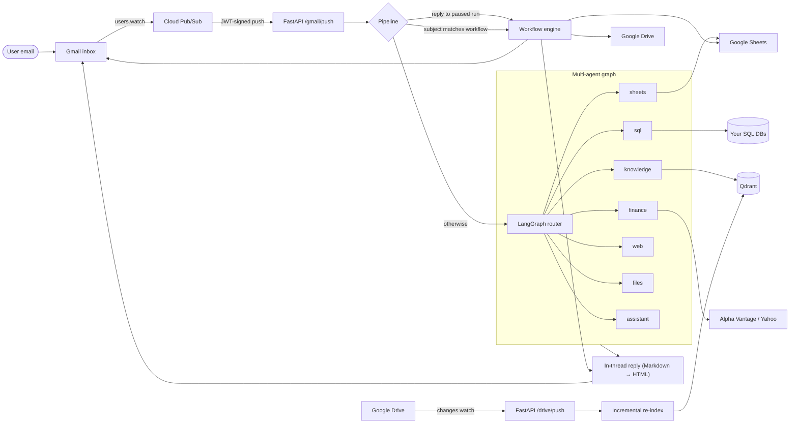
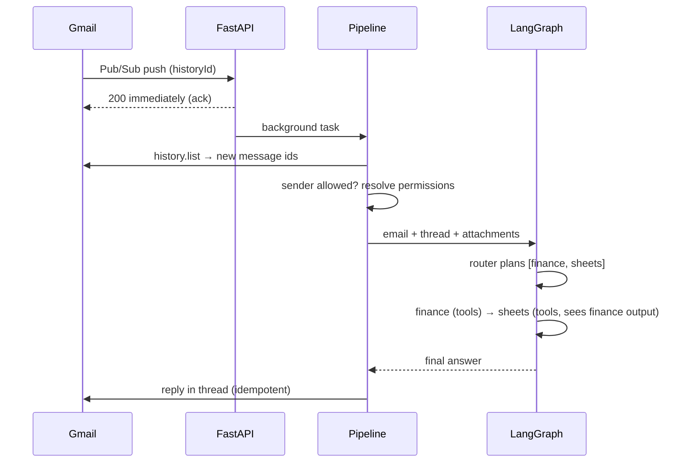

# Email Agent

**A multi-agent AI assistant your team talks to by email.** Send it a request, and it
answers in the same thread. To do that it queries your SQL databases, searches your
documents, pulls market data, updates Google Sheets and runs multi-step workflows.
Access is limited per user by role-based permissions.

[](../../actions/workflows/ci.yml)


> Built with **LangGraph · Gemini / Grok · FastAPI · Gmail & Drive push notifications ·
> Qdrant RAG · SQLAlchemy (async) · Docker**

---

## Why email?

Email is where requests already arrive, and it needs no new UI, logins or training.
Everyone on the team, including non-technical colleagues, can simply write:

> **To:** agent@company.com
> **Subject:** NVDA earnings
>
> What were NVIDIA's revenue and EPS last quarter vs. estimates? Add them to the "Earnings tracker" sheet.

A minute later a formatted reply arrives in the same thread. It contains a table of the
figures, a short interpretation and a note of which cells in the sheet were updated.

## What it can do

| Capability | Example request | How |
|---|---|---|
| **SQL analytics** | *"Top 10 customers by revenue this quarter, and who hasn't ordered in 60 days?"* | Tool-calling agent that reads the schema, then runs parameterised, read-only-guarded SQL on any configured database (MySQL, PostgreSQL, SQLite — any SQLAlchemy async driver) |
| **Knowledge base (RAG)** | *"What did we decide about pricing in last week's meeting notes?"* | Qdrant vector search over Drive Docs, Sheets, PDFs and SQL tables. Date ranges like "last week" are parsed from the question, and answers cite their sources |
| **Market data** | *"Compare AMD and NVDA gross margin trends over the last 8 quarters."* | Alpha Vantage fundamentals, earnings, transcripts and news, plus Yahoo Finance headlines |
| **Google Sheets** | *"Append today's leads to the Pipeline tab."* | Reads the header→column map before writing, and each change is idempotent |
| **Web research** | *"Summarise this article and find two counter-arguments: https://…"* | Gemini with Google Search grounding and URL reading, answers include source links |
| **Attachments** | *"Here's the contract (PDF) — list termination clauses and deadlines."* | Native multimodal input (PDF, images, audio, docs) |
| **Multi-step chains** | *"Get Apple's latest EPS **and** add it to my tracker."* | The router plans `finance → sheets`, and each step receives the previous results |
| **Workflows** | Subject: *"Weekly Market Brief"* | Multi-stage prompt pipelines defined in a Google Sheet: sources, iteration, email approval steps, actions |

## Architecture



**Request lifecycle**



### Engineering highlights

- **Pluggable specialists.** The router only sees specialists that are configured and
  allowed. Adding a capability means writing one function and one registry entry, and the
  graph is rebuilt from the registry.
- **Structured routing.** The plan comes back as a typed `RoutingDecision` (ordered agents,
  confidence, clarifying question) via structured output. Low-confidence requests get a
  clarifying question instead of a guess.
- **Role-based access control** with wildcard permission patterns (`sql:*:read`,
  `sql:crm:write`, `sheets:write`…). You can grant or deny per user, grants can expire, and
  a denial always wins. The acting user travels in a `ContextVar`, so every tool checks
  permissions even deep inside LangGraph.
- **Safe SQL.** Only one statement per call. The read tool accepts only SELECT, WITH,
  SHOW, DESCRIBE and EXPLAIN. UPDATE and DELETE without a WHERE clause are rejected, and
  databases can be marked read-only. Bind parameters are always used and results are capped.
- **Exactly-once side effects.** Pub/Sub delivers at least once and LLMs repeat tool calls,
  so replies, emails, Drive uploads, sheet appends and DB writes are all keyed and deduplicated.
- **Resilient LLM access.** Gemini API keys rotate automatically on quota errors, with an
  optional paid fallback key. Any request can switch models from the subject line, for example
  `Report -model:grok-4`.
- **Human in the loop.** A workflow stage marked `{await_reply}` emails a question and pauses.
  The run is persisted, and when the user replies in the thread it resumes from that stage.
- **Live knowledge base.** Drive push notifications trigger incremental re-indexing of changed
  Docs, Sheets and PDFs (text is extracted with Gemini's native PDF understanding). SQL tables
  are indexed via config.
- **Async throughout.** FastAPI, async SQLAlchemy and an async Qdrant client are used, and the
  blocking Google SDK calls run in worker threads.

## Quick start

**Requirements:** Python 3.12, a Gemini API key, and a Google Cloud project with the Gmail,
Drive, Docs and Sheets APIs enabled.

```bash
git clone https://github.com/CHRNVpy/email-agent.git && cd email-agent
cp .env.example .env            # set AGENT_EMAIL, GEMINI_API_KEYS, ALLOWED_SENDERS ...
pip install -e ".[dev]"

python -m app.cli auth          # one-time OAuth consent for the agent's Google account
python -m app.cli init          # create tables, default roles and the ADMIN_EMAIL user
```

**Try it without Gmail.** The `ask` command runs the full agent graph locally:

```bash
python -m app.cli ask "What can you do?"
python -m app.cli ask "Latest news and P/E for MSFT" --sender analyst@yourcompany.com
```

**Run the service** together with Qdrant:

```bash
docker compose up --build       # API on :8000, Qdrant on :6333
curl localhost:8000/health
```

To receive email, point a Pub/Sub push subscription at `https://<host>/gmail/push`. The
agent registers and renews the Gmail watch itself. A step-by-step guide is in
[docs/google-setup.md](docs/google-setup.md).

## Configuration

Everything is configured through environment variables (see [.env.example](.env.example)).
Features switch on when they are configured:

| Feature | Enable with |
|---|---|
| SQL specialist | `SQL_DATABASES={"crm": {"url": "...", "description": "...", "read_only": true}}` |
| Knowledge base | `QDRANT_URL`, then `python -m app.cli index drive` / `index sql` |
| Live Drive sync | `DRIVE_FOLDER_IDS`, `DRIVE_WEBHOOK_URL` |
| Workflows | `WORKFLOW_SHEET_ID` (format: [docs/workflows.md](docs/workflows.md)) |
| Fundamentals & earnings | `ALPHA_VANTAGE_API_KEY` (Yahoo news works without a key) |
| Grok models | `XAI_API_KEY` |

## Permissions

| Role | Grants |
|---|---|
| `admin` | `*` |
| `analyst` | finance, web, knowledge, files, sheets read/write, `sql:*:read`, workflows |
| `operator` | `sql:*:read`, `sql:*:write`, sheets, knowledge, files, workflows |
| `guest` (default for allowed but unregistered senders) | web, knowledge, files |

```bash
python -m app.cli users add alice@corp.com --role analyst
python -m app.cli perms grant alice@corp.com "sql:billing:write" --expires 2026-12-31
python -m app.cli perms deny  bob@corp.com   "sql:*:write"
python -m app.cli users show  alice@corp.com          # effective permissions
```

## Workflows in a spreadsheet

Operations teams can define repeatable multi-stage AI processes without code:

| workflow | actions | source_research | source_tickers | stage_1 | stage_2 | stage_3 |
|---|---|---|---|---|---|---|
| Weekly Market Brief | email, drive | *Drive folder URL* | `iteration=TRUE; NVDA`<br>`AMD` | Summarise key themes in {source_research} | Draft a note on {source_tickers} | Here is the outline — approve? {await_reply} |

An email whose subject contains **Weekly Market Brief** starts the run. Sources are loaded,
stages run in order with the full conversation as context, iterated stages run once per
item, and `{await_reply}` pauses the run until the user answers. See
[docs/workflows.md](docs/workflows.md).

## Project structure

```
app/
├── main.py              FastAPI: /gmail/push, /drive/push, /health
├── pipeline.py          push → authorise → workflow or agent → reply
├── agents/              LangGraph router, specialist registry, prompts, state
├── tools/               SQL, finance, Sheets, Gmail/Drive action tools
├── rag/                 chunking, Qdrant store, retrieval with date filters, indexers
├── workflows/           sheet parser, source resolver, engine, run persistence
├── permissions/         RBAC models, policy (wildcard matching), service
├── google/              OAuth, Gmail, Drive, Sheets, Pub/Sub JWT verification
├── llm.py               model factory, key rotation, retries
├── dedupe.py            idempotency guard for side effects
└── cli.py               admin CLI (auth, users, roles, perms, index, ask)
tests/                   62 tests: routing, chains, SQL agent on SQLite, RBAC, workflows, API
```

## Testing

```bash
pytest            # no network or API keys needed: LLMs are scripted, databases are SQLite
ruff check . && ruff format --check .
```

The tests run agents end to end without calling a real model. A scripted chat model emits
tool calls, so the SQL specialist really inspects the schema and queries a SQLite
database. Permission denials and unsafe queries are checked the same way.

## License

MIT
