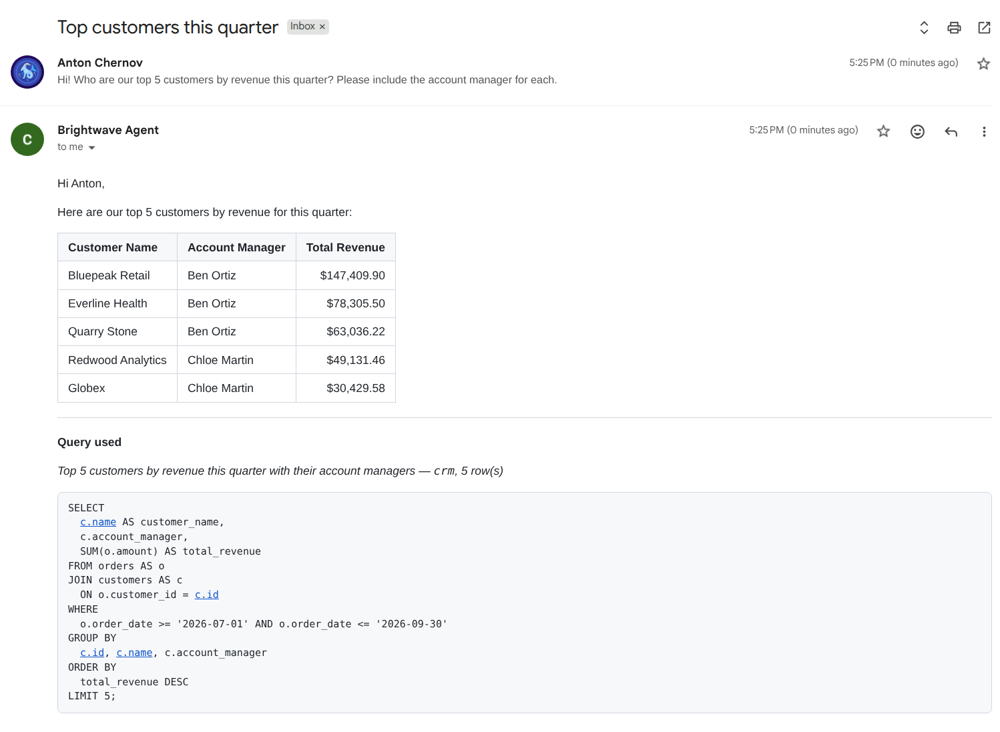
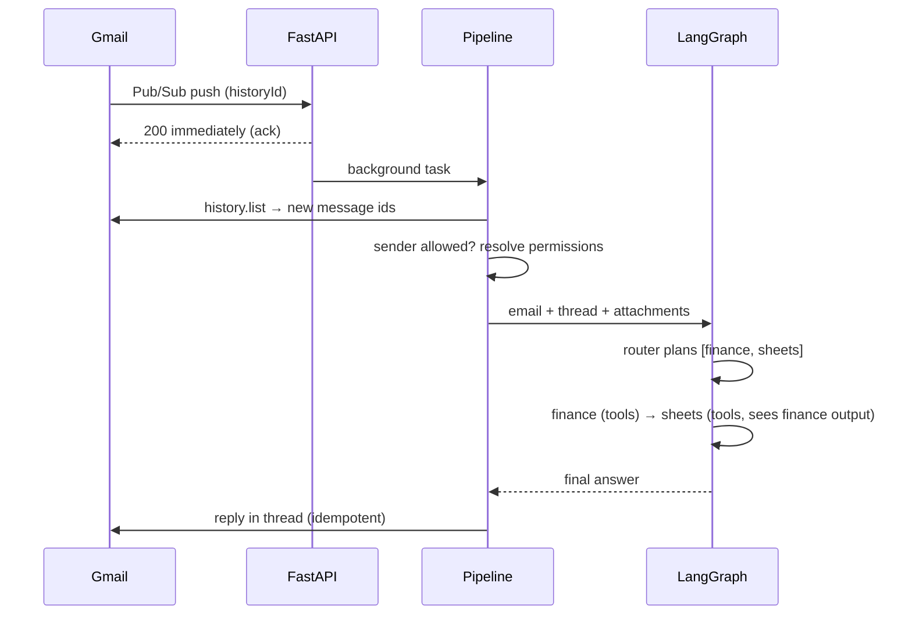

# Email Agent

**A multi-agent AI assistant your team talks to by email.** Send it a request, and it
answers in the same thread. To do that it queries your SQL databases, searches your
documents, pulls market data, updates Google Sheets and runs multi-step workflows.
Access is limited per user by role-based permissions.

[](../../actions/workflows/ci.yml)


> Built with **LangGraph · Gemini / Grok · FastAPI · Gmail & Drive push notifications ·
> Qdrant RAG · SQLAlchemy (async) · Docker**



<sub>A real reply from the [demo stand](demo/README.md), with a fictional CRM. The model planned the
SQL, code executed it, and the reply was written from the returned rows, with the executed query attached.</sub>

---

## Why email?

Email is where requests already arrive, and it needs no new UI, logins or training.
Everyone on the team, including non-technical colleagues, can simply write:

> **To:** agent@company.com
> **Subject:** NVDA earnings
>
> What were NVIDIA's revenue and EPS last quarter vs. estimates? Add them to the "Earnings tracker" sheet.

A minute later a formatted reply arrives in the same thread. It contains a table of the
figures, a short interpretation and a note of which cells in the sheet were updated.

## What it can do

| Capability | Example request | How |
|---|---|---|
| **SQL analytics** | *"Top 10 customers by revenue this quarter, and who hasn't ordered in 60 days?"* | The model plans SQL from the live schema, code executes it under a read-only guard, and the reply is written from the returned rows with the executed query attached. Works with MySQL, PostgreSQL and SQLite (any SQLAlchemy async driver) |
| **Knowledge base (RAG)** | *"What did we decide about pricing in last week's meeting notes?"* | Qdrant vector search over Drive Docs, Sheets, PDFs and SQL tables. Date ranges like "last week" are parsed from the question, and answers cite their sources |
| **Market data** | *"Compare AMD and NVDA gross margin trends over the last 8 quarters."* | Alpha Vantage fundamentals, earnings, transcripts and news, plus Yahoo Finance headlines |
| **Google Sheets** | *"Append today's leads to the Pipeline tab."* | Reads the header→column map before writing, and each change is idempotent |
| **Web research** | *"Summarise this article and find two counter-arguments: https://…"* | Gemini with Google Search grounding and URL reading, answers include source links |
| **Attachments** | *"Here's the contract (PDF) — list termination clauses and deadlines."* | Native multimodal input (PDF, images, audio, docs) |
| **Multi-step chains** | *"Get Apple's latest EPS **and** add it to my tracker."* | The router plans `finance → sheets`, and each step receives the previous results |
| **Workflows** | Subject: *"Weekly Market Brief"* | Multi-stage prompt pipelines defined in a Google Sheet: sources, iteration, email approval steps, actions |

## Architecture


**Request lifecycle**



### Engineering highlights

- **Pluggable specialists.** The router only sees specialists that are configured and
  allowed. Adding a capability means writing one function and one registry entry, and the
  graph is rebuilt from the registry.
- **Structured routing.** The plan comes back as a typed `RoutingDecision` (ordered agents,
  confidence, clarifying question) via structured output. Low-confidence requests get a
  clarifying question instead of a guess.
- **Role-based access control** with wildcard permission patterns (`sql:*:read`,
  `sql:crm:write`, `sheets:write`…). You can grant or deny per user, grants can expire, and
  a denial always wins. The acting user travels in a `ContextVar`, so every tool checks
  permissions even deep inside LangGraph.
- **Grounded SQL: the model proposes, code executes.** In a free tool-calling loop Gemini
  sometimes skipped the query tool and invented a plausible table. The SQL specialist
  therefore returns only a structured plan. Code runs it and gives the model one repair
  attempt if the SQL fails. The reply is written from the returned rows, and the executed
  query is appended by code. Other tool agents may not answer without calling a tool.
- **Number grounding.** Calling the tool isn't enough: every number in a reply is checked in code
  against the data of the same run (query rows, tool results, retrieved documents), allowing for
  formatting and rounding (`$147,410` ≈ `147409.9`, `23.45%` ≈ `0.2345`). A reply with unmatched numbers
  is retried once with the list of those numbers. If an SQL reply still does not match, it is
  replaced by the rows rendered by code; other agents keep the answer and the mismatch is recorded.
- **Safe SQL.** One statement per call. Reads accept only SELECT, WITH, SHOW, DESCRIBE and
  EXPLAIN. UPDATE and DELETE need a WHERE clause, databases can be marked read-only,
  permissions are checked per database and results are capped. For real deployments,
  connect with a read-only database user.
- **Exactly-once side effects.** Pub/Sub delivers at least once and LLMs repeat tool calls,
  so replies, emails, Drive uploads, sheet appends and DB writes are all keyed and deduplicated.
- **Resilient LLM access.** Gemini API keys rotate automatically on quota errors, with an
  optional paid fallback key. Any request can switch models from the subject line, for example
  `Report -model:grok-4`.
- **Human in the loop.** A workflow stage marked `{await_reply}` emails a question and pauses.
  The run is persisted, and when the user replies in the thread it resumes from that stage.
- **Live knowledge base.** Drive push notifications trigger incremental re-indexing of changed
  Docs, Sheets and PDFs (text is extracted with Gemini's native PDF understanding). SQL tables
  are indexed via config.
- **Async throughout.** FastAPI, async SQLAlchemy and an async Qdrant client are used, and the
  blocking Google SDK calls run in worker threads.

## Evaluation

Three small, reproducible evals run on fictional data (in [`evals/`](evals/README.md)). Every number
below links back to a JSON file with the rankings, plans and replies behind it.

**Knowledge-base retrieval.** 20 documents and 29 labelled questions, `gemini-embedding-001`
([full report](evals/results/retrieval.md)):

| | Hit@1 | Hit@3 | MRR@5 | R@5 (multi-doc) | Date questions Hit@3 |
|---|---|---|---|---|---|
| Soft date filter (default) | 0.90 | 1.00 | 0.94 | 1.00 | 1.00 |
| No date filter | 0.85 | 1.00 | 0.92 | 1.00 | 1.00 |
| Chunks of 500 characters | 1.00 | 1.00 | 1.00 | 1.00 | 1.00 |

**Routing.** 30 labelled emails × 3 runs per model, 90 decisions each ([full report](evals/results/routing.md)):

| Router model | Exact plan | First step | Asks when vague | Consistency | Latency p50 | Cost / decision |
|---|---|---|---|---|---|---|
| `gemini-3.1-flash-lite` | **1.00** | 1.00 | 1.00 | 1.00 | **1.30 s** | **$0.00020** |
| `gemini-2.5-flash` | 0.91 | 0.92 | 1.00 | 0.83 | 1.76 s | $0.00049 |

The small model routes best here: all 90 decisions were right, and it is faster and 2.5× cheaper,
so `ROUTER_MODEL=gemini-3.1-flash-lite` is the recommended setting. `gemini-2.5-flash` scored 0.91
in this run and 0.97 in the previous one. Most of its misses are clear requests that got an empty
plan in one run out of three; the agent then asks a clarifying question instead of guessing.

**End to end.** 9 typical requests × 3 runs through router → specialists → reply, with
`gemini-2.5-flash` for every step including routing ([full report](evals/results/e2e.md)). The
median request takes **6.6 s** and costs **$0.0026**. The slowest of the 27 took 11.9 s and the
most expensive cost $0.0054. Greetings and simple knowledge-base answers take 3.3–4.6 s. A two-step
`sql → assistant` chain takes 9.4–11.9 s.

**Number grounding** in the same run: 21 replies from SQL, the knowledge base, finance and chained
steps had their ~180 numbers checked against the data of the run. None needed a retry, so the check
added no model calls and no latency. The run found no misquotes, which is not proof there are
none; unit and agent tests cover detection, retry and the fallback to code-rendered rows. Web
answers are not checked, because the search results stay on Google's side.

### What the evals caught

| Finding | Change |
|---|---|
| In a tool-calling loop, Gemini skipped the SQL tool and **invented a plausible table** | The model now only plans; code executes the SQL and appends it to the reply. Other tool agents may not answer without calling a tool |
| The model did not know today's date, so "this quarter" became Q1 2024 | The current date goes into every prompt |
| `status = 'overdue'` returned 0 rows, because the real values are `open` and `paid` | The schema shown to the model now lists the values of low-cardinality columns, and databases can carry business `notes` ("revenue = SUM(orders.amount)") |
| Unanswerable questions score 0.75–0.82 and relevant documents 0.74–0.81, so **no score threshold can separate them** | The answer step abstains ("the knowledge base has nothing on parental leave"), and the e2e eval checks it |
| A hard date filter can drop an answer when the date belongs to the content rather than the document | Soft filter: documents from the time window are ranked first and the rest follow. The LLM date parser only runs when a question contains a time expression, which skips the 1.6–1.9 s call for 17 of the 29 eval questions |
| 1 of 27 requests spent **248 s and $0.15** in open-ended model reasoning | Reasoning budget for planning calls, output-token caps and a 120 s timeout on every LLM call. In the latest run the slowest of 27 requests took 11.9 s and the most expensive cost $0.0054 |
| With a 2,048-token output cap, `gemini-3.1-flash-lite` returned invalid routing JSON (probably because its reasoning counts against the cap) | Higher caps for structured calls, after which it made 0 errors in 90 decisions. A routing failure now returns a polite retry message, and the eval records it as a per-email error instead of dropping the model |
| After the model called its tool, nothing stopped it from misquoting the result in the reply (raised in a review of this project) | Number grounding: every number in a reply is checked in code against the data of the same run, with one retry and, for SQL, a fallback to the rows themselves |
| All three router models tended to add an extra `assistant` step | A routing rule, and a separate `ROUTER_MODEL`. With both, `gemini-3.1-flash-lite` routed all 90 eval emails correctly |

## Quick start

**Requirements:** Python 3.12, a Gemini API key, and a Google Cloud project with the Gmail,
Drive, Docs and Sheets APIs enabled.

```bash
git clone https://github.com/CHRNVpy/email-agent.git && cd email-agent
cp .env.example .env            # set AGENT_EMAIL, GEMINI_API_KEYS, ALLOWED_SENDERS ...
pip install -e ".[dev]"

python -m app.cli auth          # one-time OAuth consent for the agent's Google account
python -m app.cli init          # create tables, default roles and the ADMIN_EMAIL user
```

**Try it without Gmail.** The `ask` command runs the full agent graph locally; `--stats` prints
the plan, time per stage, tool calls, tokens and cost:

```bash
python -m app.cli ask "What can you do?"
python -m app.cli ask "Latest news and P/E for MSFT" --sender analyst@yourcompany.com --stats
```

**Demo in 10 minutes.** [`demo/`](demo/README.md) has a fictional CRM, a knowledge base, a sample
contract and five demo emails. `python -m app.cli poll` answers email by polling the inbox, so a
demo needs neither Pub/Sub nor a public URL.

**Run the service** together with Qdrant:

```bash
docker compose up --build       # API on :8000, Qdrant on :6333
curl localhost:8000/health
```

To receive email, point a Pub/Sub push subscription at `https://<host>/gmail/push`. The
agent registers and renews the Gmail watch itself. A step-by-step guide is in
[docs/google-setup.md](docs/google-setup.md).

## Configuration

Everything is configured through environment variables (see [.env.example](.env.example)).
Features switch on when they are configured:

| Feature | Enable with |
|---|---|
| SQL specialist | `SQL_DATABASES={"crm": {"url": "...", "description": "...", "notes": "revenue = SUM(orders.amount)", "read_only": true}}` |
| Cheaper routing | `ROUTER_MODEL=gemini-3.1-flash-lite` |
| Knowledge base | `QDRANT_URL`, then `python -m app.cli index drive` / `index sql` |
| Live Drive sync | `DRIVE_FOLDER_IDS`, `DRIVE_WEBHOOK_URL` |
| Workflows | `WORKFLOW_SHEET_ID` (format: [docs/workflows.md](docs/workflows.md)) |
| Fundamentals & earnings | `ALPHA_VANTAGE_API_KEY` (Yahoo news works without a key) |
| Grok models | `XAI_API_KEY` |

## Permissions

| Role | Grants |
|---|---|
| `admin` | `*` |
| `analyst` | finance, web, knowledge, files, sheets read/write, `sql:*:read`, workflows |
| `operator` | `sql:*:read`, `sql:*:write`, sheets, knowledge, files, workflows |
| `guest` (default for allowed but unregistered senders) | web, knowledge, files |

```bash
python -m app.cli users add alice@corp.com --role analyst
python -m app.cli perms grant alice@corp.com "sql:billing:write" --expires 2026-12-31
python -m app.cli perms deny  bob@corp.com   "sql:*:write"
python -m app.cli users show  alice@corp.com          # effective permissions
```

## Workflows in a spreadsheet

Operations teams can define repeatable multi-stage AI processes without code:

| workflow | actions | source_research | source_tickers | stage_1 | stage_2 | stage_3 |
|---|---|---|---|---|---|---|
| Weekly Market Brief | email, drive | *Drive folder URL* | `iteration=TRUE; NVDA`<br>`AMD` | Summarise key themes in {source_research} | Draft a note on {source_tickers} | Here is the outline — approve? {await_reply} |

An email whose subject contains **Weekly Market Brief** starts the run. Sources are loaded,
stages run in order with the full conversation as context, iterated stages run once per
item, and `{await_reply}` pauses the run until the user answers. See
[docs/workflows.md](docs/workflows.md).

## Project structure

```
app/
├── main.py              FastAPI: /gmail/push, /drive/push, /health
├── pipeline.py          push → authorise → workflow or agent → reply
├── agents/              LangGraph router, specialists, grounded SQL, number grounding, prompts
├── tools/               SQL, finance, Sheets, Gmail/Drive action tools
├── rag/                 chunking, Qdrant store, retrieval with date filters, indexers
├── workflows/           sheet parser, source resolver, engine, run persistence
├── permissions/         RBAC models, policy (wildcard matching), service
├── google/              OAuth, Gmail, Drive, Sheets, Pub/Sub JWT verification
├── llm.py               model factory, key rotation, reasoning budgets, timeouts
├── telemetry.py         per-request latency, tool calls, tokens and cost
├── dedupe.py            idempotency guard for side effects
└── cli.py               admin CLI (auth, users, roles, perms, index, ask, poll)
evals/                   retrieval / routing / end-to-end evals, corpus, labelled cases, results
demo/                    fictional CRM seeder, demo config, sample contract, demo emails
tests/                   102 tests: routing, chains, grounded SQL, number grounding, RBAC, workflows, RAG, API
```

## Testing

```bash
pytest            # no network or API keys needed: LLMs are scripted, databases are SQLite
ruff check . && ruff format --check .
```

The tests run agents end to end without calling a real model; any accidental real LLM call fails
the test. A scripted chat model returns plans and tool calls, so the SQL specialist really executes
queries on SQLite, repairs a failing query, and refuses unsafe or unauthorised statements. The
knowledge-base tests run on an in-memory Qdrant. For quality, latency and cost with real models,
see [Evaluation](#evaluation).

## License

MIT
